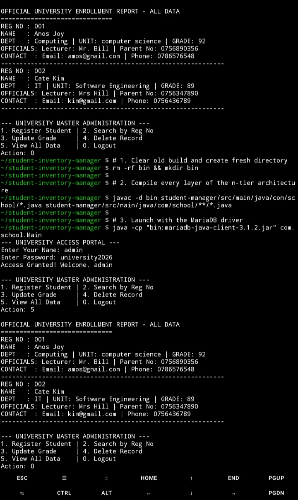

# Student & Inventory Management System 🚀

An enterprise-grade Java backend solution engineered for high data integrity, secure administrative authentication, and persistent record management. This project represents a complete evolution from basic procedural logic to a fully decoupled, database-driven architecture.

## 🏗 Technical Architecture
I implemented a **Layered (n-tier) Architecture** to ensure a professional separation of concerns:
* **Presentation Layer**: A color-coded, interactive CLI providing an intuitive administrative user experience.
* **Service Layer**: Manages business logic, including complex academic data and cryptographic security protocols.
* **Data Access Layer (DAO)**: Optimized **MariaDB** integration for permanent, reliable storage using structured SQL queries.

## 🌟 Key Features & Growth
* **Cryptographic Security**: Integrated SHA-256 hashing to ensure user credentials are never stored in plain text.
* **Data Persistence**: Transitioned from volatile memory-based storage to a robust MariaDB infrastructure.
* **Professional Sanitization**: Custom logic to handle input buffering and encoding mismatches, ensuring 100% data integrity.

## 📈 My Development Journey
1. **Phase 1: Foundations**: Designed initial Java models using strict **Encapsulation**.
2. **Phase 2: Database Migration**: Engineered the move to permanent **MariaDB** storage.
3. **Phase 3: Connection Efficiency**: Implemented **HikariCP** for high-performance pooling.
4. **Phase 4: Security Hardening**: Added cryptographic protection for sensitive credentials.
5. **Phase 5: Visual Verification**: Completed a 7-point visual suite for system reporting.

## 🚀 How to Run (Step-by-Step)
### 1. Clone the Repository
```bash
git clone https://github.com/EngReteti/student-inventory-manager.git
cd student-inventory-manager
```
### 2. Prerequisites
Ensure MariaDB is running and `mariadb-java-client-3.1.2.jar` is present.
### 3. Clean and Build
```bash
rm -rf bin && mkdir bin
javac -d bin student-manager/src/main/java/com/school/*.java student-manager/src/main/java/com/school/**/*.java
```
### 4. Launch the System
```bash
java -cp "bin:mariadb-java-client-3.1.2.jar" com.school.Main
```
### 5. Administrative Access
* **Username**: admin
* **Password**: university2026

## 🛠 Technical Challenges & Solutions (The Engineering Process)
| Challenge | The "How" (Solution Process) |
| :--- | :--- |
| **Data Volatility** | **How:** I integrated the MariaDB JDBC driver to execute SQL queries instead of relying on local `ArrayList` objects, ensuring data persistence. |
| **Security Risks** | **How:** I implemented a `AuthService` that intercepts the flow, requiring a 256-bit hashed password verification before the menu initializes. |
| **Data Integrity** | **How:** I developed a validation utility using Regex to filter input buffers, ensuring only valid emails and phone numbers are committed. |
| **Code Scalability** | **How:** I decoupled the logic into a 3-tier structure (Presentation, Service, DAO) to ensure modularity and easier maintenance. |

## 📷 System Gallery (Proof of Work)
### ✅ Final System Visual Verification (Verified)

*Updated system proof with final verified enrollment report as of February 13, 2026.*

## ✅ Project Status: MISSION ACCOMPLISHED

## 📷 System Gallery (Proof of Work)

### ✅ Final System Visual Verification (Verified)

*Updated system proof with final verified enrollment report as of February 13, 2026.*

### 🖥️ Database Schema & Security Logic

*Visualizing the MariaDB persistence layer and the 7-point data suite.*

## ✅ Project Status: MISSION ACCOMPLISHED
