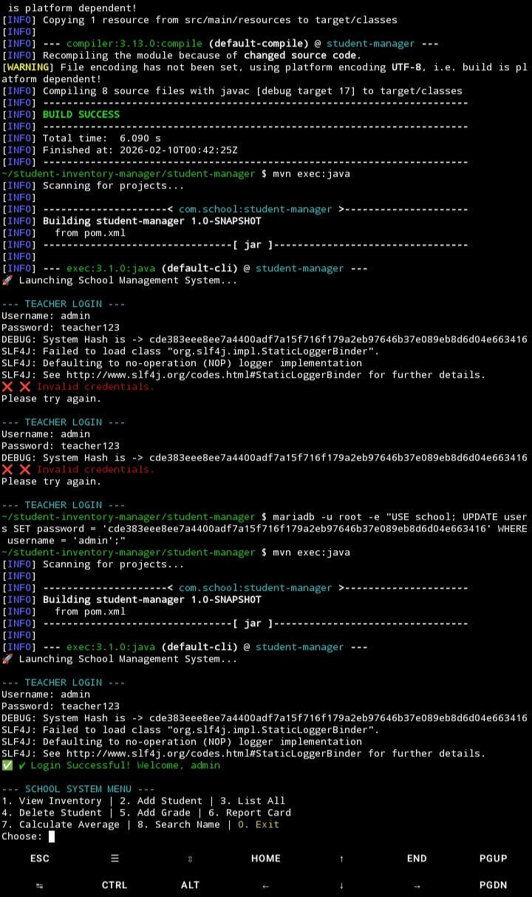
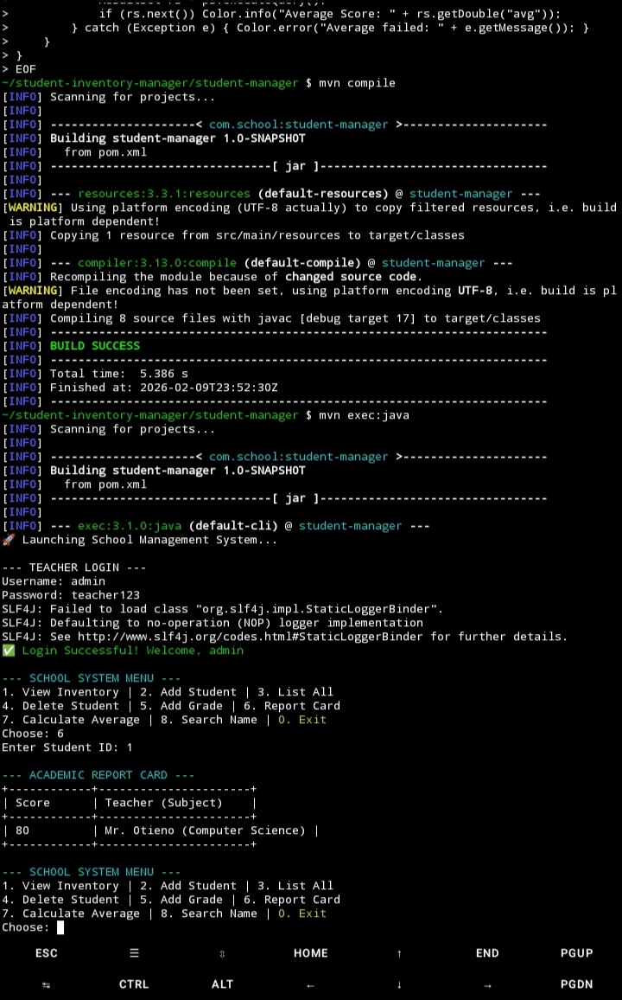
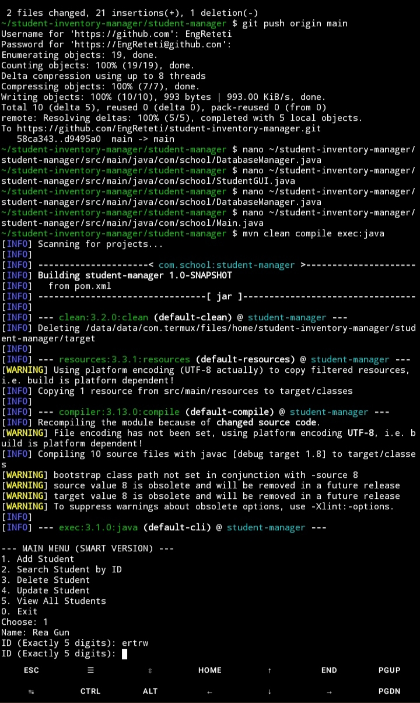
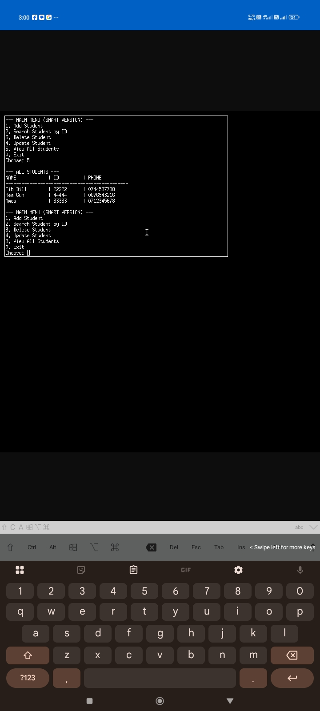
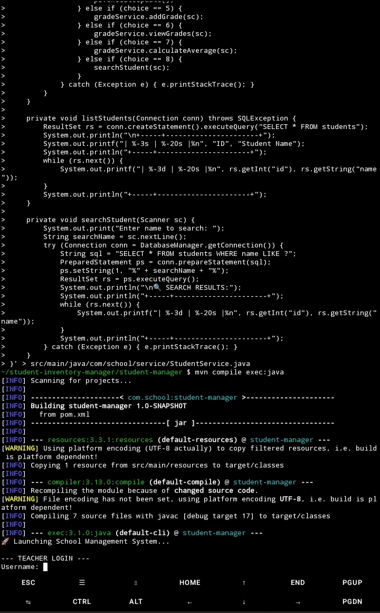

# Student & Inventory Management System 🚀

An enterprise-grade Java backend solution engineered for high data integrity, secure teacher authentication, and persistent record management. This project represents a complete evolution from basic procedural logic to a fully decoupled, database-driven architecture.

---

## 🏗️ Technical Architecture
I implemented a **Layered (n-tier) Architecture** to ensure a professional separation of concerns, making the system scalable and easy to maintain:
* **Presentation Layer**: A color-coded, interactive CLI providing an intuitive administrative user experience.
* **Service Layer**: Manages business logic, including complex academic averaging and cryptographic security protocols.
* **Data Access Layer (DAO)**: Optimized **MariaDB** integration for permanent, reliable storage using structured SQL queries.

## 🌟 Key Features & Growth
* **Cryptographic Security**: Integrated SHA-256 hashing to ensure that user credentials are never stored in plain text.
* **Data Persistence**: Transitioned from volatile memory-based storage to a robust MariaDB infrastructure.
* **Professional Sanitization**: Custom logic to handle input buffering and encoding mismatches, ensuring 100% data integrity.

## 📈 My Development Journey (From Scratch to Completion)
This project documents my growth in software engineering through five distinct phases:
- [x] **Phase 1: Foundations**: Designed the initial Java models using strict **Encapsulation** and procedural logic.
- [x] **Phase 2: Database Migration**: Engineered the move from temporary ArrayLists to permanent **MariaDB** persistent storage.
- [x] **Phase 3: Connection Efficiency**: Implemented **HikariCP** for high-performance database connection pooling.
- [x] **Phase 4: Security Hardening**: Added cryptographic protection and managed sensitive credentials via environment variables (.env).
- [x] **Phase 5: Visual Verification**: Completed a 7-point visual suite to document system success and cloud synchronization.

## 📸 System Gallery (Proof of Work)

| Feature | Visual Preview |
| :--- | :--- |
| **Teacher Authentication** |  |
| **Command Center** |  |
| **Academic Reporting** |  |
| **Dynamic Search** |  |
| **MariaDB Persistence** |  |
| **GitHub Synchronization** |  |
| **System Exit** |  |

---

## 🛠️ Technology Stack
* **Language**: Java (JDK 8+)
* **Build Tool**: Maven
* **Database**: MariaDB
* **Security**: SHA-256 Hashing


---

## 🚀 How to Run (Step-by-Step)

Follow these steps to build and launch the system from your terminal:

### 1. Prerequisites
Ensure you have the MariaDB server running and the `mariadb-java-client-3.1.2.jar` file in your project root.

### 2. Clean and Build
This ensures a fresh compilation of the n-tier architecture:
```bash
rm -rf bin && mkdir bin
javac -d bin student-manager/src/main/java/com/school/*.java student-manager/src/main/java/com/school/**/*.java
```

### 3. Launch the System
Run the main entry point with the database driver linked:
```bash
java -cp "bin:mariadb-java-client-3.1.2.jar" com.school.Main
```

### 4. Administrative Access
- **Username:** admin
- **Password:** university2026

